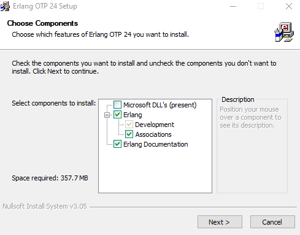
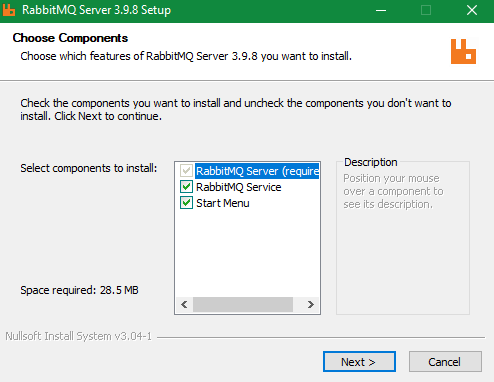
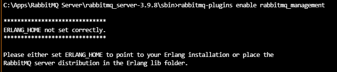
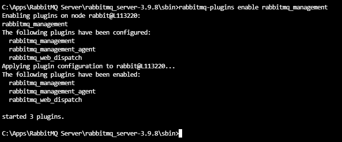
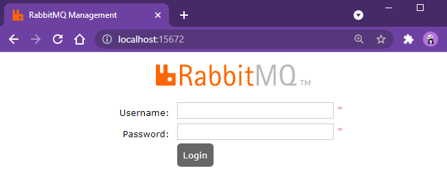
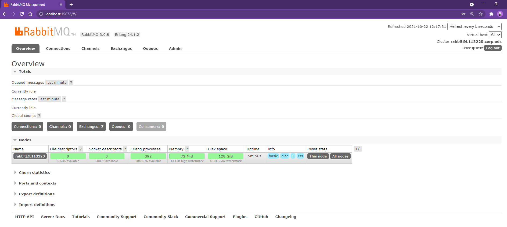

# Install RabbitMQ on windows 10

## Download & Install

Erlang for Windows 10, 64 bit, OTP v24.1.2
RabbitMQ for Windows 10, 64 bit, v3.9.8

## Set up

```
cd <RabbitMQ_HOME>\sbin
rabbitmq-plugins enable rabbitmq_management
```

```
http://localhost:15672
guest
guest
```

## Screenshot












