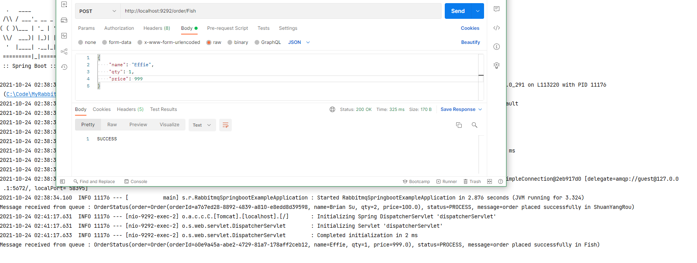

# RabbitMQ Spring Boot

## Set up RabbitMQ

```
cd <RabbitMQ_HOME>\sbin
rabbitmq-plugins enable rabbitmq_management
```

```
??? rabbitmq-server.bat start
```

```
http://localhost:15672
guest
```

## Knowledge Points

```
Pub / Producer / Publisher
Sub / Consumer / Subscriber
Spring for RabbitMQ
Routing key
Message
Queue
TopicExchange
Binding
MessageConverter
Jackson2JsonMessageConverter
AmqpTemplate
ConnectionFactory
RabbitListener
```

## Screenshot





